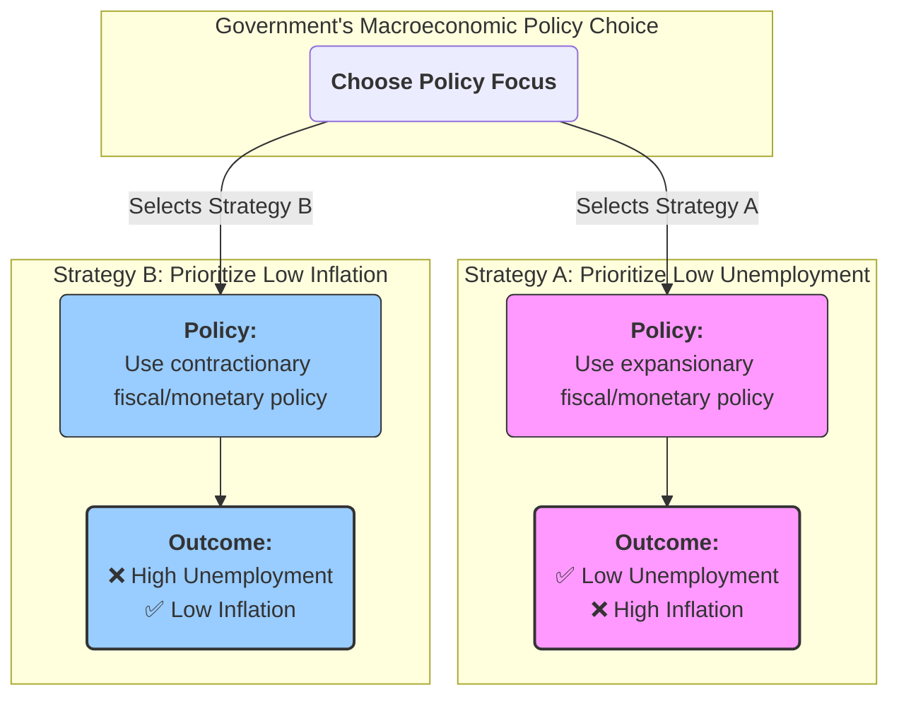

```mermaid
graph TD
    subgraph "Government's Macroeconomic Policy Choice"
        Choice("<b>Choose Policy Focus</b>")
    end

    subgraph "Strategy A: Prioritize Low Unemployment"
        S1("<b>Policy:</b><br>Use expansionary fiscal/monetary policy")
        O1("<b>Outcome:</b><br>✅ Low Unemployment<br>❌ High Inflation")
    end

    subgraph "Strategy B: Prioritize Low Inflation"
        S2("<b>Policy:</b><br>Use contractionary fiscal/monetary policy")
        O2("<b>Outcome:</b><br>❌ High Unemployment<br>✅ Low Inflation")
    end

    Choice -- "Selects Strategy A" --> S1 --> O1
    Choice -- "Selects Strategy B" --> S2 --> O2

    style S1 fill:#f9f,stroke:#333
    style O1 fill:#f9f,stroke:#333,stroke-width:2px

    style S2 fill:#9cf,stroke:#333
    style O2 fill:#9cf,stroke:#333,stroke-width:2px
```
